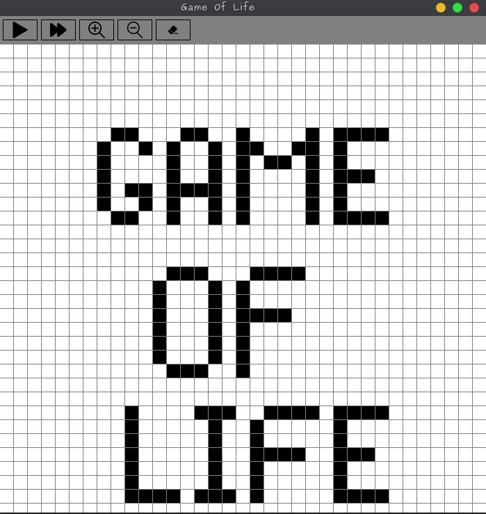
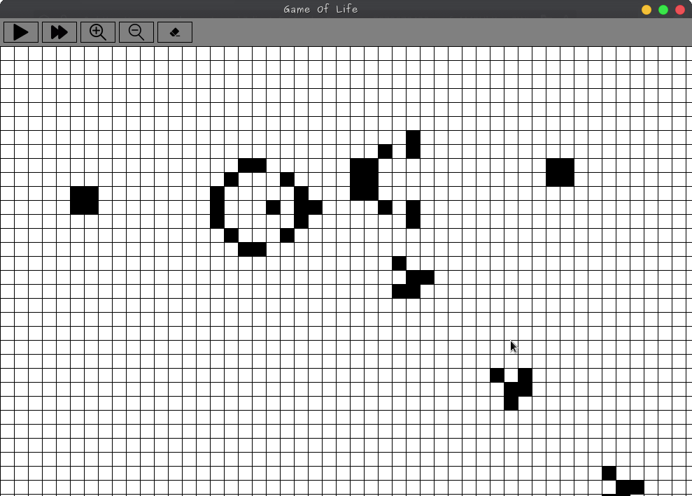

# Game of Life

A simple implementation of Conway's Game of Life using Java Swing.


## Features

- Graphical visualization using Java Swing
- Customizable initial configurations
- Step-by-step progression or continuous run

## Usage

1. Clone the repository:

    ```bash
    git clone https://github.com/sohan-reza/GameOfLife.git
    ```

2. Open the project in IntelliJ IDEA.

3. Run the `Main` class to start the Game of Life simulation.

## Screenshots



